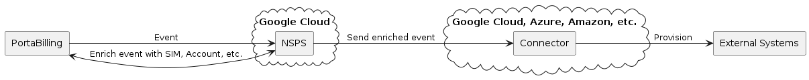

# NSPS Connector Implementation Guide

## Table of Contents

1. [Purpose](#purpose)
2. [Overview](#overview)
3. [Implementation specific](#implementation-specific)
    1. [Requirements](#requirements)
    2. [Request handling](#request-handling)
        1. [Request body](#request-body)
        2. [Request headers](#request-headers)
        3. [Event types](#event-types)
    3. [Configuration](#configuration)
    4. [Logging](#logging)
    5. [Error handling](#error-handling)
4. [Deployment](#deployment)
5. [Testing](#testing)
6. [Infrastructure Considerations](#infrastructure-considerations)

---

## Purpose

This document provides **implementation and configuration guidance** for partners wishing to **integrate their connectors with the NSPS** using Docker microservices. Please note that this document **does not cover** topics such as monitoring, high availability, disaster recovery, or other operational and infrastructure-related aspects. These areas are considered out of scope and are the responsibility of the solution architect overseeing the connector’s deployment and maintenance.

## Overview

The primary goal of the NSPS is to automate the provisioning and service updates of external network systems (e.g., HLR, PCRF) triggered by changes within PortaBilling. This includes some similar tasks such as service activation, deactivation, and configuration updates. NSPS is aimed to provide an alternative and light-weight tool for cloud provisioning to cover some basic flows. If some fancy workflow logic is needed - it's worth to consider [PortaOne Workflows solution](https://www.portaone.com/telecom-products/portaone-workflows/) instead.

The connector is a service that receives events enriched by NSPS from PortaBilling, selects the necessary parameters, and sends them to the external system in the format required by that external system.

The example provided in this document is designed to run in GCP or AWS. However, the new connector can run in any cloud (Azure, AWS, OCI, etc.) or on-premises, as it is designed as a Docker microservice.

> **Note:**
>
> - Hosting expenses for your connectors deployed in cloud platforms **won't be covered** by PortaOne.
> - There is a local deployment option, at no extra cost, to consider:
>     - assuming test purposes or development - local PC/laptop
>     - assuming production but low traffic / load (otherwise, extra server(s) is required to handle the load): [Docker Swarm managed via PortaBilling Portainer Stack](https://wiki.portaone.com/x/0fWuCg)

The interaction of the components is shown in the diagram below.



## Implementation specific

### Requirements

- Authentication of all requests to the connector using a Bearer token.
- Event payload schema parsing
- Handling specific [events](https://docs.portaone.com/docs/mr121-events-that-espf-handlers-support?topic=eventsender-handler-events) (e.g., SIM activated, Plan changed, etc.)
- Configurable settings for [External API server](https://swagger.io/docs/specification/v3_0/api-host-and-base-path/):
    - API base URL with optional base path
    - API access credentials (depends on the system implementation. This can be either Basic Auth, Bearer Auth with a static token, or support for example JWT. The connector should work with access_tokens and refresh_tokens if the system requires it)
- Response codes:
    - 2XX for a successfully processed event (with optional JSON response body)
    - 4XX and 5XX codes for unsuccessfully processed events (with human-readable error explanation in response JSON body)

An example is available here - [WTL HLR/HSS Connector](https://gitlab.portaone.com:8949/read-only/wtl_hlr_hss_connector).

The connector should provide 2 methods:

1. **GET health endpoint** is needed to check the availability of the connector itself (this method should return just 200 OK with some optional response body).
2. **POST method** is used by the NSPS system as a destination. The URL may or may not contain a path (options such as `https://connector.com`, `https://connector.com/api/events` are OK).

You can view or download an example of the OpenAPI specification below.

[](https://wiki.portaone.com/display/REQSPEC/NSPS+Connector+Implementation+Guide?preview=/277253881/283843264/OpenAPI.json#NSPSConnectorImplementationGuide-Purpose)

[Click here to view/download OpenAPI spec](../assets/OpenAPI.json)

<!-- <details>
  <summary>Click here to expand OpenAPI spec ...</summary>

```json

```
</details>  -->

### Request handling

The [ESPF event](https://docs.portaone.com/docs/mr121-events-that-espf-handlers-support?topic=eventsender-handler-events) generated by [EventSender](https://docs.portaone.com/docs/mr121-provisioning-via-webhooks?topic=provisioning-event-version) contains a limited set of [variables](https://docs.portaone.com/docs/mr121-provisioning-via-webhooks?topic=provisioning-event-version) (event type, i_account, i_env, etc.), but external systems usually require more information (about the main product, add-ons, used quotas, etc.).

<details>
  <summary>Example of ESPF event</summary>

```json
{
    "event_type": "SIM/Updated",
    "variables": {
        "i_env": 3,
        "i_event": 999999,
        "i_account": 277147,
        "event_time": "2025-05-01 12:00:00"
    }
}
```

</details>

Therefore, the NSPS system makes API [requests](https://docs.portaone.com/) to PortaBilling in order to get more information about the account, SIM, etc., which relates to the created event. The NSPS adds all the necessary data and passes it to the connector.

#### Request body

NSPS sends the following request body to the connector (so the connector should accept it):

| Field Name   | Mandatory | Description                                                                                     |
| ------------ | --------- | ----------------------------------------------------------------------------------------------- |
| `pb_data`    | No        | Enriched data from PortaBilling; includes account, SIM, and access policy info. Defaults empty. |
| `data`       | Yes       | Event payload, represented by an instance of `ESPFEvent`.                                       |
| `handler_id` | No        | Optional identifier of the handler assigned to process the event.                               |
| `status`     | No        | Status of event processing. Defaults to `EventStatus.UNDEFINED`.                                |
| `created_at` | No        | Timestamp when the event was created.                                                           |
| `updated_at` | No        | Timestamp when the event was last enriched by NSPS.                                             |
| `event_id`   | Yes       | Unique identifier of the event.                                                                 |

The field called `data` contains the generated ESPF event as it is. So if you don't need additional info from PortaBilling, you can only use this data.

The data structure for the `pb_data` is shown below. It includes all possible fields. The connector should contain logic to process only the parameters it needs, and unnecessary ones can be ignored.

For a more detailed description of the parameters, please refer to [docs.portaone.com](https://docs.portaone.com/API/mr120/AccountInterface/#overview).

| Field Path                                                             | Mandatory | Type                            | Description                                                                                                                                                                                                                                                                                                                                                                                                                                                                                                                                                                      |
| ---------------------------------------------------------------------- | --------- | ------------------------------- | -------------------------------------------------------------------------------------------------------------------------------------------------------------------------------------------------------------------------------------------------------------------------------------------------------------------------------------------------------------------------------------------------------------------------------------------------------------------------------------------------------------------------------------------------------------------------------- |
| `pb_data.account_info`                                                 | No        | `AccountInfo`                   | Main account-level data container                                                                                                                                                                                                                                                                                                                                                                                                                                                                                                                                                |
| `pb_data.account_info.bill_status`                                     | No        | `str`                           | The billing status of the account.<br>Mapped values (originally single-letter codes):<br>- O → active<br>- S → suspended<br>- I → inactive<br>- C → terminated                                                                                                                                                                                                                                                                                                                                                                                                                   |
| `pb_data.account_info.billing_model`                                   | No        | `str`                           | The account type.<br>Mapped values (originally int codes):<br>- -1 → debit_account<br>- 0 → recharge_voucher<br>- 1 → credit_account<br>- 2 → alias<br>- 4 → beneficiary                                                                                                                                                                                                                                                                                                                                                                                                         |
| `pb_data.account_info.blocked`                                         | No        | `bool`                          | Boolean conversion - Indicates whether account's calls and access to the self-care interface is blocked (originally Y/N string, converted Y → False, N → True)                                                                                                                                                                                                                                                                                                                                                                                                                   |
| `pb_data.account_info.email`                                           | No        | `str`                           | The email address associated with the account                                                                                                                                                                                                                                                                                                                                                                                                                                                                                                                                    |
| `pb_data.account_info.firstname`                                       | No        | `str`                           | The account owner's first name                                                                                                                                                                                                                                                                                                                                                                                                                                                                                                                                                   |
| `pb_data.account_info.i_account`                                       | No        | `int`                           | Internal ID of the account. Visible in URL resource path on Admin UI page                                                                                                                                                                                                                                                                                                                                                                                                                                                                                                        |
| `pb_data.account_info.i_customer`                                      | No        | `int`                           | The ID of the customer record to which the account belongs                                                                                                                                                                                                                                                                                                                                                                                                                                                                                                                       |
| `pb_data.account_info.i_master_account`                                | No        | `int`                           | The ID of the parent account                                                                                                                                                                                                                                                                                                                                                                                                                                                                                                                                                     |
| `pb_data.account_info.i_product`                                       | No        | `int`                           | The ID for the account's product                                                                                                                                                                                                                                                                                                                                                                                                                                                                                                                                                 |
| `pb_data.account_info.i_vd_plan`                                       | No        | `int`                           | The unique ID of the bundle assigned to the account individually                                                                                                                                                                                                                                                                                                                                                                                                                                                                                                                 |
| `pb_data.account_info.id`                                              | No        | `str`                           | Charging ID (MSISDN, ICCID or IMSI) of the account on the network. Visible as ID in Admin UI                                                                                                                                                                                                                                                                                                                                                                                                                                                                                     |
| `pb_data.account_info.lastname`                                        | No        | `str`                           | The account owner's last name                                                                                                                                                                                                                                                                                                                                                                                                                                                                                                                                                    |
| `pb_data.account_info.phone1`                                          | No        | `str`                           | The main phone number                                                                                                                                                                                                                                                                                                                                                                                                                                                                                                                                                            |
| `pb_data.account_info.product_name`                                    | No        | `str`                           | The name of the account's product                                                                                                                                                                                                                                                                                                                                                                                                                                                                                                                                                |
| `pb_data.account_info.status`                                          | No        | `str`                           | The current status of the account based on factors such as "expiration time", "activation time" etc.<br>Possible values:<br>- active<br>- customer_exported<br>- expired<br>- quarantine<br>- screening<br>- closed<br>- inactive<br>- customer_suspended<br>- customer_limited<br>- customer_provisionally_terminated<br>- blocked<br>- customer_blocked<br>- not_yet_active<br>- credit_exceeded<br>- overdraft<br>- customer_has_no_available_funds<br>- customer_credit_exceed<br>- zero_balance<br>- customer_suspension_delayed<br>- customer_limiting_delayed<br>- frozen |
| `pb_data.account_info.time_zone_name`                                  | No        | `str`                           | The name of the account's time zone. Examples: "Europe/Prague", "America/Vancouver", etc.                                                                                                                                                                                                                                                                                                                                                                                                                                                                                        |
| `pb_data.account_info.zip`                                             | No        | `str`                           | The postal (zip) code                                                                                                                                                                                                                                                                                                                                                                                                                                                                                                                                                            |
| `pb_data.account_info.assigned_addons`                                 | No        | `List[AssignedAddon]`           | The list of the account's add-on products                                                                                                                                                                                                                                                                                                                                                                                                                                                                                                                                        |
| `pb_data.account_info.assigned_addons[].addon_effective_from`          | No        | `str`                           | ISO datetime string - The date and time when the add-on product is activated for an account                                                                                                                                                                                                                                                                                                                                                                                                                                                                                      |
| `pb_data.account_info.assigned_addons[].addon_effective_to`            | No        | `str`                           | ISO datetime string - The date and time when the add-on product assigned to an account expires                                                                                                                                                                                                                                                                                                                                                                                                                                                                                   |
| `pb_data.account_info.assigned_addons[].addon_priority`                | No        | `int`                           | The priority level of the add-on product                                                                                                                                                                                                                                                                                                                                                                                                                                                                                                                                         |
| `pb_data.account_info.assigned_addons[].description`                   | No        | `str`                           | The internal product description                                                                                                                                                                                                                                                                                                                                                                                                                                                                                                                                                 |
| `pb_data.account_info.assigned_addons[].i_product`                     | No        | `int`                           | The unique ID of the product                                                                                                                                                                                                                                                                                                                                                                                                                                                                                                                                                     |
| `pb_data.account_info.assigned_addons[].i_product_group`               | No        | `int`                           | The unique ID of the product group to which the product belongs                                                                                                                                                                                                                                                                                                                                                                                                                                                                                                                  |
| `pb_data.account_info.assigned_addons[].i_vd_plan`                     | No        | `int`                           | The unique ID of the bundle assigned to the product                                                                                                                                                                                                                                                                                                                                                                                                                                                                                                                              |
| `pb_data.account_info.assigned_addons[].name`                          | No        | `str`                           | The product name                                                                                                                                                                                                                                                                                                                                                                                                                                                                                                                                                                 |
| `pb_data.account_info.service_features`                                | No        | `List[ServiceFeature]`          | The list of service features                                                                                                                                                                                                                                                                                                                                                                                                                                                                                                                                                     |
| `pb_data.account_info.service_features[].name`                         | No        | `str`                           | The service feature name                                                                                                                                                                                                                                                                                                                                                                                                                                                                                                                                                         |
| `pb_data.account_info.service_features[].effective_flag_value`         | No        | `str`                           | The actual service feature flag value. Possible values:<br>- 'Y' → enabled<br>- 'N' → disabled                                                                                                                                                                                                                                                                                                                                                                                                                                                                                   |
| `pb_data.account_info.service_features[].attributes`                   | No        | `List[ServiceFeatureAttribute]` | The list of service feature attributes                                                                                                                                                                                                                                                                                                                                                                                                                                                                                                                                           |
| `pb_data.account_info.service_features[].attributes[].name`            | No        | `str`                           | The service feature attribute internal name                                                                                                                                                                                                                                                                                                                                                                                                                                                                                                                                      |
| `pb_data.account_info.service_features[].attributes[].effective_value` | No        | `str`                           | Service feature attribute value, comma-separated if multiple values                                                                                                                                                                                                                                                                                                                                                                                                                                                                                                              |
| `pb_data.sim_info`                                                     | No        | `SimInfo`                       | SIM card information from PortaBilling                                                                                                                                                                                                                                                                                                                                                                                                                                                                                                                                           |
| `pb_data.sim_info.i_account`                                           | No        | `int`                           | The unique ID of the account to which the SIM card belongs                                                                                                                                                                                                                                                                                                                                                                                                                                                                                                                       |
| `pb_data.sim_info.i_sim_card`                                          | No        | `int`                           | The unique ID of the SIM card                                                                                                                                                                                                                                                                                                                                                                                                                                                                                                                                                    |
| `pb_data.sim_info.iccid`                                               | No        | `str`                           | The Integrated Circuit Card ID                                                                                                                                                                                                                                                                                                                                                                                                                                                                                                                                                   |
| `pb_data.sim_info.imsi`                                                | No        | `str`                           | The unique International Mobile Subscriber Identity of the SIM card                                                                                                                                                                                                                                                                                                                                                                                                                                                                                                              |
| `pb_data.sim_info.status`                                              | No        | `str`                           | The status of the SIM card                                                                                                                                                                                                                                                                                                                                                                                                                                                                                                                                                       |

#### Request headers

NSPS sends the following headers to the connector used for tracing and debugging:

- [x-b3-traceid](https://www.envoyproxy.io/docs/envoy/latest/configuration/http/http_conn_man/headers#x-b3-traceid)
- [x-request-id](https://www.envoyproxy.io/docs/envoy/latest/configuration/http/http_conn_man/headers#x-request-id)

The connector should process them and add them to all log messages related to the processing of a specific request. If the headers were not delivered, the connector should generate unique values (for example, use UUID-compatible format).

#### Event types

| Event type  | Trigger conditions                                                                                   | Most used fields |
| ----------- | ---------------------------------------------------------------------------------------------------- | ---------------- |
| SIM/Updated | - SIM card details have been changed, e.g., the default PIN for inactive SIM cards has been changed. |

- The SIM card data specified in a custom field has been changed, e.g., the “Amazon” value is set in the “Marketplace” custom field.
- [SIM card status](https://docs.portaone.com/docs/mr122-sim-card-inventory?topic=comprehensive-details-and-group-operations-in-sim-card-inventory) has been changed, e.g., from “In use” to “Disposed”.
- An account’s ID has changed. ([Account.id](http://Account.id) has been updated.)
- Another product was assigned to the account. An account’s product has changed. (Account.i_product has been updated.)
- An account’s add-on product has been changed.
- An add-on product has been removed from an account.
- A new add-on product has been added for an account.
- The user has topped up (“recharged”) their bundle of any service type to get more service volume before bundle renewal.
- An account has exceeded its service usage quota (for services of all types except **Messaging** and **Internet access**).
- A service feature has been enabled/disabled for an account (the Service_Attribute_Values table has been updated).
- Custom information (e.g., ID card) has been added or changed for an account. (The Custom_Field_Values table has been updated for the account.)
- An account’s billing status has been changed or affected by the customer’s billing status. A customer’s status has changed. (Customers.bill_status has changed.)
- An account has been blocked. (Accounts.blocked set to ‘Y.’)
- An account has been unblocked. (Accounts.blocked set to ‘N.’)
- Bundle is successfully activated for the first time (the bundle has never been activated for this account before).
- Bundle is assigned to the account.
- [Bundle has expired](https://docs.portaone.com/docs/mr122-balance-dependent-renewable-bundles) (for balance-dependant renewable type).
- Grace period for the bundle is over (for balance-dependant renewable type).
- Bundle is removed from the account.
- Bundle is automatically renewed for the account (for balance-dependant renewable type).
- Bundle is successfully activated after expiration (for balance-dependant renewable type). | `pb_data.sim_info.imsi`  
  `pb_data.account_info.i_account`  
  `pb_data.account_info.i_product`  
  `pb_data.account_info.bill_status`  
  `pb_data.account_info.blocked`  
  `pb_data.account_info.product_name`  
  `pb_data.account_info.assigned_addons[].i_product`  
  `pb_data.account_info.assigned_addons[].name`  
  `pb_data.account_info.assigned_addons[].i_vd_plan`  
  `pb_data.access_policy_info.attributes["name"=="cs_profile"].values[0]`  
  `pb_data.access_policy_info.attributes["name"=="eps_profile"].values[0]` |
  | SIM/Created | A SIM card has been added to the inventory. | `pb_data.sim_info.imsi`  
  `pb_data.account_info.i_account` |
  | SIM/Deleted | A SIM card has been removed from the inventory. | `pb_data.sim_info.imsi`  
  `pb_data.account_info.i_account` |
  | SIM/Replaced | A SIM card has been assigned to, removed from or changed for an account. | `pb_data.sim_info`  
  `pb_data.prev_sim_info` |

### Configuration

Typically, a connector should contain parameters that are needed to connect to the external system, as well as some that are needed by the application itself. The simplest and most straightforward option is to pass environment variables.

The connector must verify all requests by checking the Bearer token. Therefore, there is a need to set this token in the connector. It is recommended to set it as an environment variable (e.g., `API_TOKEN`) and read it in the code. This way, by changing only the environment variable, you can quickly update the access token in case it is compromised.

**Requirements:**

- configurable bearer token to access the service
- configurable external system credentials

### Logging

Logging is an important part that allows debugging when necessary.

**Requirements:**

- Logs should be written in JSON format (for search integration)
- Log `x-b3-traceid` header to `request_id` field
- Log `x-request-id` header to `unique_id` field

Logging these headers allows you to track all the events that occur with the event from its very beginning — entering the NSPS.

### Error handling

- Errors should be logged.
- Each error response must contain a JSON body with an explanation of the reason for the error.

## Deployment

Since the connector is designed as a Docker microservice, it can be deployed in any cloud, for example, using a cloud-specific utility. Below are examples of scripts that you can use, but you can write your own that are simpler or more complex to suit your needs.

**Example for GCP**: [deploy as a Cloud Run](https://gitlab.portaone.com:8949/read-only/wtl_hlr_hss_connector/-/tree/main/_gcp-deploy?ref_type=heads). Official guide on how to deploy Cloud Run services you can find [here](https://cloud.google.com/run/docs/deploying#gcloud).

A Cloud Run service URL typically follows the format: `https://[TAG---]SERVICE_IDENTIFIER.run.app`. `SERVICE_IDENTIFIER` is a unique, stable identifier for the service, and the TAG refers to the traffic tag of the specific revision. The SERVICE_IDENTIFIER includes a random string and the region shortcut.

https://[TAG---]SERVICE_NAME-PROJECT_NUMBER.REGION.run.app

where:

- **TAG** is the optional [traffic tag](https://cloud.google.com/run/docs/rollouts-rollbacks-traffic-migration#tags) for the revision that you are requesting.
- **PROJECT_NUMBER** is the Google Cloud [project number](https://cloud.google.com/resource-manager/docs/creating-managing-projects).
- **SERVICE_NAME** is the name of the Cloud Run service.
- **REGION** is the name of the region, such as `us-central1`.

**Example for AWS**: [deploy as an App Runner](https://gitlab.portaone.com:8949/read-only/wtl_hlr_hss_connector/-/tree/main/_aws-deploy?ref_type=heads). Official guide on how to deploy App Runner services you can find [here](https://docs.aws.amazon.com/apprunner/latest/dg/manage-deploy.html).

An App Runner service URL typically follows the format: `https://[service-id].[region].awsapprunner.com` where `service-id` is a unique identifier for your service and `region` is the AWS region where your service is hosted.

For example: `https://abcd1234efgh.us-east-1.awsapprunner.com`

## Testing

First, you can make sure that the service is up and running by sending a **health check request**.

<details>
<summary>Example</summary>

```bash
$ curl https://[TAG---]SERVICE_NAME-PROJECT_NUMBER.REGION.run.app
```

```json
{
    "status": "Healthy"
}
```

</details>

Then you need to send a request with the expected data structure

<details>
<summary>Example</summary>

```bash
curl -X POST https://[TAG---]SERVICE_NAME-PROJECT_NUMBER.REGION.run.app \
  -H "Authorization: Bearer your-api-token" \
  -H "Content-Type: application/json" \
  -d '{
    "event_id": "3e84c79f-ab6f-4546-8e27-0b6ab866f1fb",
    "data": {
      "event_type": "SIM/Updated",
      "variables": {
        "i_env": 1,
        "i_event": 999999,
        "i_account": 1,
        "curr_status": "used",
        "prev_status": "active"
      }
    },
    "pb_data": {
      "account_info": {
        "bill_status": "open",
        "billing_model": "credit_account",
        "blocked": false,
        "firstname": "Serhii",
        "i_account": 1,
        "i_customer": 6392,
        "i_product": 3774,
        "id": "79123456789@msisdn",
        "lastname": "Dolhopolov",
        "phone1": "",
        "product_name": "Pay as you go",
        "time_zone_name": "Europe/Prague",
        "assigned_addons": [
          {
            "addon_effective_from": "2025-05-16T12:59:46",
            "addon_priority": 10,
            "description": "",
            "i_product": 3775,
            "i_vd_plan": 1591,
            "name": "Youtube UHD"
          }
        ],
        "service_features": [
          {
            "name": "netaccess_policy",
            "effective_flag_value": "Y",
            "attributes": [
              {
                "name": "access_policy",
                "effective_value": "179"
              }
            ]
          }
        ]
      },
      "sim_info": {
        "i_sim_card": 3793,
        "imsi": "001010000020349",
        "msisdn": "79123456789",
        "status": "active"
      },
      "access_policy_info": {
        "i_access_policy": 179,
        "name": "Integration test",
        "attributes": [
          {
            "group_name": "lte.wtl",
            "name": "cs_profile",
            "value": "cs-pp-20250319"
          },
          {
            "group_name": "lte.wtl",
            "name": "eps_profile",
            "value": "eps-pp-20250319"
          }
        ]
      }
    },
    "handler_id": "hlr-hss-nsps",
    "created_at": "2025-03-12T16:47:30.443939+00:00",
    "updated_at": "2025-03-12T16:47:36.585885+00:00",
    "status": "received"
  }'
```

```json
{ "message": "Event processed successfully" }
```

</details>

**What should be tested:**

- Auth
- Response codes (2XX, 4XX, 5XX)
- Changes to the external system

It is worth testing this service with some kind of external staging system. It is not recommended to use production immediately without being sure that the service works correctly.

## Infrastructure Considerations

The default deployment of NSPS, PortaBilling, and Connector/Core is intended to run in a public internet environment, where services can communicate freely over the network. However, in specific cases, it may be necessary to restrict public access to components for security reasons.

At this time, we can provide a **static IP address** used by NSPS to make requests to both the Connector and PortaBilling.

VPN connectivity is not currently supported and is under consideration ([DO-5364](https://youtrack.portaone.com/issue/DO-5364)).
