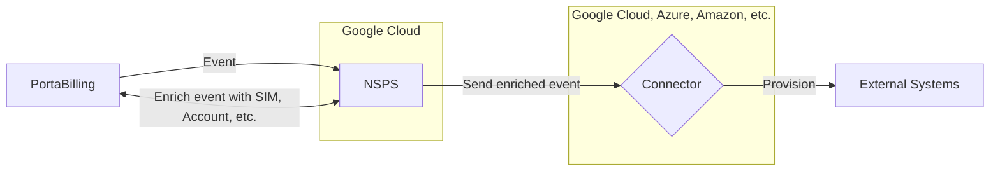

# Introduction

**NSPS Connector Implementation Guide** provides **implementation and configuration guidance** for partners wishing to **integrate their connectors with the [NSPS][nsps]** using Docker microservices. Please note that it **does not cover** topics such as monitoring, high availability, disaster recovery, or other operational and infrastructure-related aspects. These areas are considered out of scope and are the responsibility of the solution architect overseeing the connector’s deployment and maintenance.

## Provisioning System Overview

The system consists of:

- [**PortaBilling**][portabilling]: Generates minimal events (e.g., customer creation, service activation) and sends them via webhooks.
- **Cloud Provider**: Represents the infrastructure environment (such as GCP, OCI, AWS, etc.) where the NSPS system is deployed. It provides essential cloud services for monitoring, logging, and hosting all system components. This ensures scalability, reliability, and observability of the entire provisioning system.
- [**External Network Systems**][external-system] (e.g. HSS, PCRF etc): Requires updates based on the events received, with each system having its own proprietary API.
- [**NSPS (New Service Provisioning System)**][nsps]: Processes events, enriches data, and provisions the necessary external network systems.

The primary goal of the NSPS is to **automate** the provisioning and service updates of external network systems triggered by changes within PortaBilling. This includes some similar tasks such as service activation, deactivation, and configuration updates. NSPS is aimed to provide an alternative and light-weight tool for cloud provisioning to cover some basic flows. If some fancy workflow logic is needed - it's worth to consider [PortaOne Workflows solution][portaone-workflows-solution] instead.

The [**connector**][connector] is a service that **receives** events enriched by NSPS from PortaBilling, **selects** the necessary parameters, and **sends** them to the external system in the format required by that external system.

The interaction of the components is shown in the diagram below.

<!-- References -->
[portabilling]: https://docs.portaone.com/docs/mr124-system-architecture-overview
[portaone-workflows-solution]: https://www.portaone.com/telecom-products/portaone-workflows/
[docker-swarm]: https://wiki.portaone.com/x/0fWuCg

[nsps]: NSPS/nsps-overview.md
[connector]: connector-overview.md
[external-system]: NSPS/nsps-overview.md#external-network-system